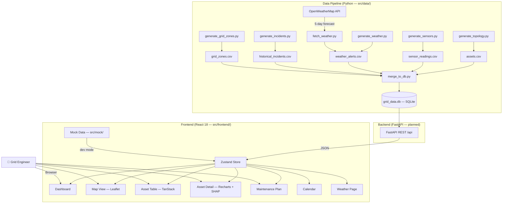

# Architecture

## System Architecture

GridGuard AI is composed of two independent layers: a **Python data pipeline** that generates and persists grid telemetry into SQLite, and a **React SPA** that visualises that data. A FastAPI backend (planned, not yet deployed) will bridge them via a REST API.

## Components

| Component | Technology | Responsibility |
|---|---|---|
| Data pipeline orchestrator | Python 3.11, `run_all.py` | Runs all generators in sequence, then merges into SQLite |
| Grid topology generator | Python / pandas | Produces 105 assets (transformers + substations) across 5 zones with lat/lng, customers served, install year |
| Sensor generator | Python / NumPy | Generates 30 days × hourly readings per asset with realistic failure signatures (healthy / degrading / near-failure tiers) |
| Weather generator | Python / requests | Synthetic weather alert events (2023–2026); optionally fetches live 5-day forecasts from OpenWeatherMap free API |
| Incident generator | Python / pandas | 300 historical outage/failure records (2023–2025) weighted toward older, high-load assets |
| Database layer | SQLite (`grid_data.db`) | Single-file database holding all 5 tables; zero-setup for evaluators |
| Backend API | FastAPI (planned) | Will serve `/api/assets`, `/api/maintenance`, `/api/weather`, `/api/summary` to the frontend |
| Frontend SPA | React 18 + Vite + TypeScript | Eight-page dashboard; currently runs on rich mock data until the backend is deployed |
| State management | Zustand | Single store (`useAppStore`) holds assets, maintenance tasks, and UI filters; `loadData()` fetches from API or mock |
| Grid map | Leaflet + react-leaflet | Renders all assets as colour-coded risk markers; popup on click navigates to asset detail |
| Charts | Recharts | Sensor trend line charts (30-day history), SHAP bar chart, risk gauge |
| Asset table | TanStack Table v8 | Sortable, filterable, paginated table of all grid assets |

## Data Flow

1. **Pipeline runs:** `python src/data/run_all.py` — takes ~4 seconds on any machine with Python 3.11.
2. **Topology first:** `generate_topology.py` creates the 105-asset `assets.csv` with geographic coordinates centred around Delhi (28.6°N, 77.2°E) to give the Leaflet map realistic spatial spread.
3. **Sensor data depends on topology:** `generate_sensors.py` receives the assets DataFrame and assigns each asset a health tier (healthy / degrading / near-failure) using `RANDOM_SEED=42` for reproducibility. It writes 75 600 rows to `sensor_readings.csv`.
4. **Weather and incidents are independent:** `generate_weather.py` and `generate_incidents.py` produce their CSVs in parallel (within the sequential pipeline).
5. **Zone metadata is derived:** `generate_grid_zones.py` aggregates `assets.csv` per zone — total customers, critical facilities, area — so `grid_zones.csv` is always consistent with the topology.
6. **Merge to SQLite:** `merge_to_db.py` loads all 5 CSVs into SQLite and runs cross-table foreign key checks (every `asset_id` in sensor/incident tables must exist in `assets`).
7. **Frontend loads data:** On page load, `useAppStore.loadData()` calls the API (or falls back to `src/mock/mockData.ts` in dev). The Zustand store distributes data to all page components via selectors.
8. **Risk display:** Each asset renders its `risk_score` (0–100) as a colour-coded badge and Leaflet marker (green → yellow → orange → red). Clicking an asset opens `AssetDetail`, which shows sensor trend charts and the SHAP explanation.

## Security Considerations

- API keys (`OPENWEATHERMAP_API_KEY`) are read from environment variables via `python-dotenv`; they are never hardcoded in source files.
- `.env` files are in `.gitignore` — only `.env.example` is committed.
- The frontend `VITE_API_BASE_URL` env var controls the API target, preventing accidental calls to production from a dev build.
- The FastAPI backend (when deployed) should add Bearer token authentication on all `/api/*` routes before any production use.

## Scalability Notes

The current architecture is a hackathon prototype. To scale:

- **Database:** Replace SQLite with PostgreSQL. The `schema.sql` DDL is already compatible — only the connection string in `merge_to_db.py` needs updating.
- **Backend:** The planned FastAPI app is stateless and can be horizontally scaled behind a load balancer (e.g., on IBM Code Engine or Kubernetes).
- **Sensor ingestion:** Replace the batch CSV pipeline with a streaming ingestion layer (e.g., IBM Event Streams / Kafka) that feeds the same SQLite/PostgreSQL schema in real time.
- **ML model:** The XGBoost scorer can be deployed as a watsonx.ai custom model endpoint, replacing the in-pipeline scoring with an API call — enabling online retraining as new sensor data arrives.
