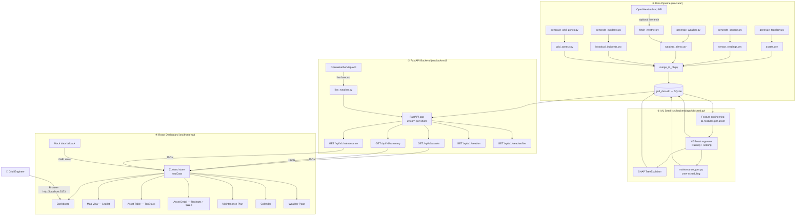

# Architecture

## System Architecture

GridHealth AI has three layers that all share a single SQLite database: a Python data-generation pipeline that creates the dataset, a FastAPI backend that runs ML scoring and serves a REST API, and a React frontend that visualises the results.

## Components

| Component | Technology | Responsibility |
|---|---|---|
| Data pipeline | Python 3.11, pandas, NumPy | Generates all 5 CSV datasets and merges them into SQLite. Runs once via `python run_all.py`. |
| Topology generator | `generate_topology.py` | 105 assets (70% transformers, 30% substations) across 5 Delhi-NCR zones with real coordinates. |
| Sensor generator | `generate_sensors.py` | 30 days × hourly readings per asset with physically realistic failure signatures (healthy / degrading / near-failure tiers, `RANDOM_SEED=42`). |
| Weather generator | `generate_weather.py` / `fetch_weather.py` | Synthetic alert events (2023–2026) OR live OWM 5-day forecasts classified into typed events. |
| ML seed | `app/db/seed.py` | Trains XGBoost on 11-feature aggregated sensor matrix, computes SHAP, writes `risk_scores` + `shap_values` + `maintenance_tasks` to the shared DB. |
| FastAPI backend | FastAPI 0.111, SQLAlchemy 2.0, Pydantic v2 | Four route groups: assets, summary, maintenance, weather. Starts instantly (no ML at startup). |
| Prediction service | `services/prediction.py` | Feature engineering SQL, XGBoost train/load, SHAP TreeExplainer, priority score formula. |
| Maintenance service | `services/maintenance_gen.py` | Schedules tasks by risk tier (CRITICAL=day 0, HIGH=1–2, MEDIUM=3–6, LOW=7–13) with round-robin crew assignment. |
| Live weather service | `services/live_weather.py` | 18 Indian state area mappings; spreads 5 zone centers, fetches OWM forecasts, classifies + groups into alert events. |
| Database | SQLite `grid_data.db` | Single file shared by all layers. 5 data tables + 3 ML tables. No DB server required. |
| React SPA | React 18, Vite, TypeScript, Tailwind CSS | 8 pages, 4 themes, Zustand state with API-first + mock fallback. |
| Grid map | Leaflet + react-leaflet | Colour-coded risk markers across 5 geographic zones; click opens Asset Detail. |
| Charts | Recharts | 30-day sensor trend line charts, SHAP feature-importance bar chart, risk gauge. |
| Asset table | TanStack Table v8 | Sortable, filterable, paginated; filter by risk level, zone, asset type, status. |

## API Endpoints

| Method | Path | Description |
|---|---|---|
| `GET` | `/api/v1/summary` | Grid-wide KPI counts (critical/high/medium/low, maintenance today, last updated) |
| `GET` | `/api/v1/assets` | All assets with risk scores; query params: `risk_level`, `zone`, `sort`, `order`, `limit` |
| `GET` | `/api/v1/assets/{id}` | Single asset with SHAP explanations |
| `GET` | `/api/v1/assets/{id}/sensors` | Sensor time-series; query params: `days`, `limit` |
| `GET` | `/api/v1/maintenance` | Maintenance tasks; query params: `asset_id`, `priority`, `status` |
| `GET` | `/api/v1/weather` | DB-stored alerts; query params: `zone`, `severity`, `active_only` |
| `GET` | `/api/v1/weather/areas` | List of selectable Indian state areas |
| `GET` | `/api/v1/weather/live` | Real-time OWM alerts; query param: `area` (e.g., `Maharashtra`) |

Full interactive docs available at `http://localhost:8000/docs` when the backend is running.

## Data Flow

1. `python run_all.py` (from `src/data/`) — generates all CSVs and merges into `grid_data.db` (~4 s).
2. `python -m app.db.seed` (from `src/backend/`) — reads the 5 data tables, trains XGBoost, writes 3 ML tables back into the same DB (~10–20 s first run; loads saved model on subsequent runs).
3. `uvicorn app.main:app` — FastAPI starts, creates ML tables if missing (non-destructive), serves requests.
4. React app loads — `useAppStore.loadData()` fetches from `/api/v1/assets`, `/api/v1/summary`, `/api/v1/maintenance` in parallel; maps backend shapes to frontend types; falls back to mock data if the API is unavailable.
5. User navigates — Zustand selectors distribute data to each page component with no additional fetches.
6. Asset Detail page — triggers `GET /api/v1/assets/{id}` (with SHAP) when a specific asset is opened.
7. Weather Live page — triggers `GET /api/v1/weather/live?area=…` which calls OWM in real time.

## Security Considerations

- The OWM API key is read from environment variables (`OPENWEATHERMAP_API_KEY`) via `python-dotenv` — never hardcoded in source.
- `.env` files are in `.gitignore`; only `.env.example` is committed.
- The frontend `VITE_API_BASE_URL` env var isolates API target between dev and production builds.
- The FastAPI backend has CORS configured to `http://localhost:5173` by default; override with `CORS_ORIGIN` env var.
- No authentication is implemented — not production-ready.

## Scalability Path

| Concern | Production upgrade |
|---|---|
| Database | Replace SQLite with PostgreSQL — the SQLAlchemy models and DDL are already compatible |
| Model retraining | Move `seed.py` logic to a scheduled task or watsonx.ai custom model endpoint |
| Sensor ingestion | Replace batch CSV pipeline with IBM Event Streams (Kafka) feeding the same DB schema in real time |
| Backend | FastAPI is stateless — horizontally scalable behind a load balancer on IBM Code Engine or Kubernetes |
| Frontend | Vite produces optimised static assets deployable to any CDN (IBM Cloud Object Storage + CDN) |
